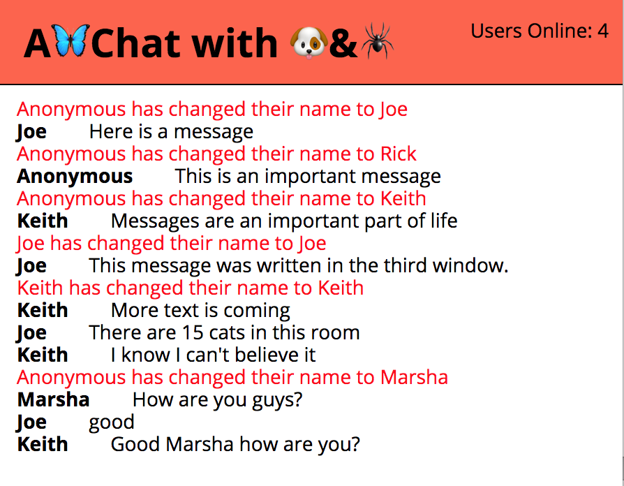
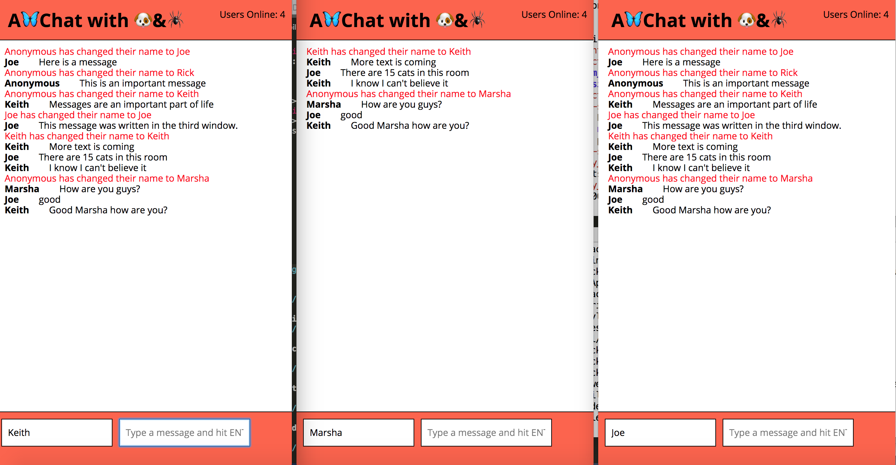
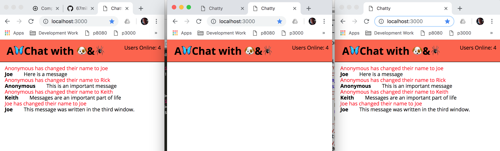

# Chatty App

Amedus is a simple restaurant app.

Users are provided a menu of items to add to a shopping cart.  They may remove items from the cart as well as increase the quanity of a particular item.  Pricing totals will update dynamically.  Once the user confirms their order they provide their telephone number and payment information (payment info for placeholding purposes only).  The user is sent an SMS confirming their order while the restaurant is sent an SMS indicating an order has been placed (the user name, telephone number and a link to review the user order is provided).  The restaurant owner has the option to click the link in the SMS and choose to edit the time for order pickup, cancel the order and add an optional custom message.  The contents of the message are sent via SMS to the user.

## Dependencies

devDependencies:
    - "babel-core": "6.23.1",
    - "babel-loader": "6.3.1",
    - "babel-preset-es2015": "6.22.0",
    - "babel-preset-react": "6.23.0",
    - "babel-preset-stage-0": "6.22.0",
    - "css-loader": "0.26.1",
    - "eslint": "3.15.0",
    - "eslint-plugin-react": "6.9.0",
    - "node-sass": "4.5.0",
    - "sass-loader": "6.0.0",
    - "sockjs-client": "^1.1.2",
    - "style-loader": "0.13.1",
    - "webpack": "2.2.1",
    - "webpack-dev-server": "2.3.0"

dependencies:
    - "express": "4.16.4",
    - "react": "15.4.2",
    - "react-dom": "15.4.2",
    - "uuid": "^3.3.2",
    - "ws": "6.1.2"

## Getting Started

1. Create the `.env` by using `.env.example` as a reference: `cp .env.example .env`
2. Update the .env file with your correct local information
3. Install dependencies: `npm i`
4. Run migrations: `npm run knex migrate:latest`
  - Check the migrations folder to see what gets created in the DB
5. Run the seed: `npm run knex seed:run`
  - Check the seeds file to see what gets seeded in the DB
6. Run the  server: `node server.js`
7. Visit `http://localhost:8080/`
8. Enjoy!

## Functionality

Main menu page (/)...customer can:
- add an item to cart
- cart changes dynamically
- click cart to go to cart page

Cart page (/checkout)...customer can:
- view all items in cart
- add or reduce quantity of a particular item in cart
- remove an item from cart
- return to menu to add more items

SMS: upon confirmation of an order:
- SMS sent to customer thanking them and telling them a pickup time will be sent
- SMS sent to restuarant with link to order to view order, set pickup time, cancel order and set an optional custom message

Order and time for pickup page (/orderdisplay/uniqueordernumber)...restaurant owner can:
- view username, phone number of customer who ordered
- see all items and total cost of order
- select 5, 15, 30 minutes OR cancel order
- provide an optional custom message

SMS: upon restaurant owner selecting a time or cancelling order
- customer is informed of pickup time OR order has been cancelled
- customer recieves any custom message created by restuarant

## File Structure

Important folders and files are indicated in the tree diagram below:

<ul>
  <li>/react-simple-boilerplate:  holdover name for React driven app Chatty</li>
  <ul>
    <li>/build: contains images</li>
    <li>/chatty_server</li>
    <ul>
      <li>server.js: runs the express server and websocket functionality on port 3001</li>
    </ul>
    <li>/src</li>
    <ul>
      <li>App.jsx: the Parent component that communicates with the websocket server</li>
      <li>ChatBar.jsx: child component to App which takes user content for username and messages</li>
      <li>Message.jsx: child component to MessageList which renders styling on messages</li>
      <li>MessageList.jsx: Parent to Messages, child to App is the container for the message log</li>
    </ul>
    <li>/styles</li>
    <ul>
      <li>application.scss </li>
      <li>home.scss: main css file for styling</li>
    </ul>
    <li>index.html: shell for the dynamically created HTML via React components</li>
    <li>package.json</li>
    <li>README.md</li>
    <li>server.js: simple server that runs the app on port 3000 </li>
    <li>webpack.config.js: webpack setup files</li>
  </ul>
</ul>

## Screenshots

#### Message Log:

#### Multi User Chat:

#### New Users and User Count:

